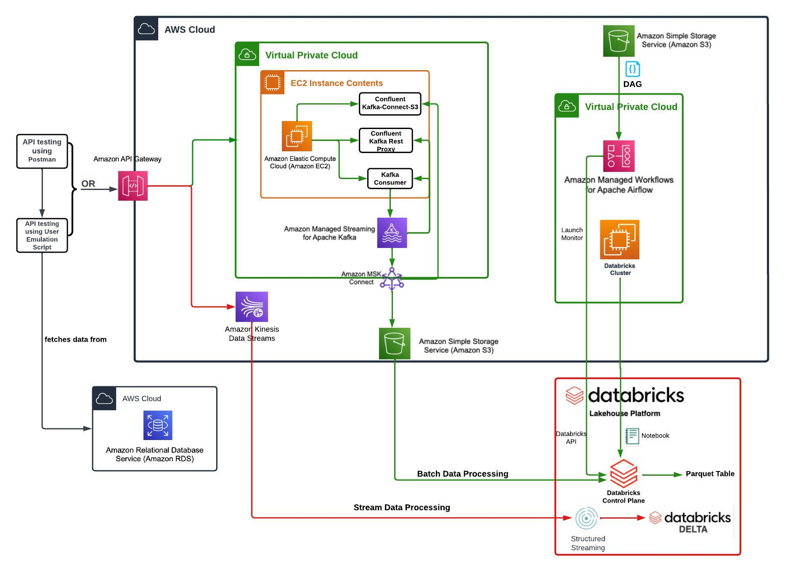
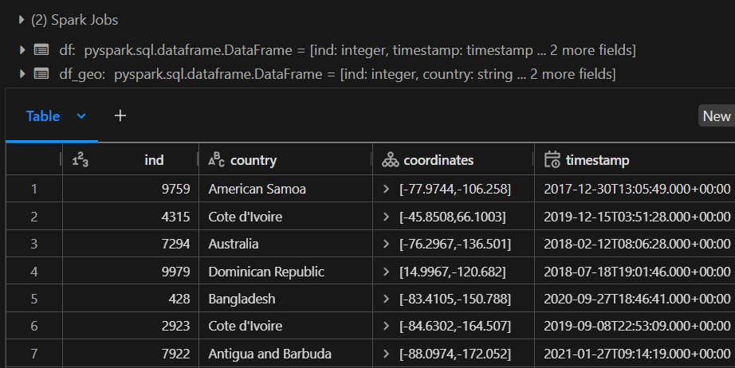
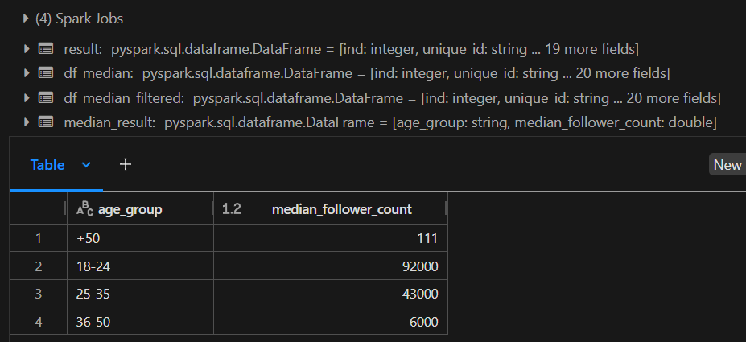

# Pinterest Data Pipeline

- [Pinterest Data Pipeline](#pinterest-data-pipeline)
  - [Overview](#overview)
    - [Architecture Diagram](#architecture-diagram)
    - [Outputs](#outputs)
      - [Task 2 - Cleaning data about geolocation of posts to df\_geo](#task-2---cleaning-data-about-geolocation-of-posts-to-df_geo)
      - [Task 8 - Find the median follower count for different age groups](#task-8---find-the-median-follower-count-for-different-age-groups)
  - [Features](#features)
  - [Setup](#setup)
    - [Kafka on EC2](#kafka-on-ec2)
    - [Populate topics on S3](#populate-topics-on-s3)
    - [Read from S3 to Databricks](#read-from-s3-to-databricks)
    - [Getting started with Airflow on Windows](#getting-started-with-airflow-on-windows)
    - [Configure GitHub access on WSL2 Instance](#configure-github-access-on-wsl2-instance)
  - [Batch Processing: AWS MMA](#batch-processing-aws-mma)
    - [Transform data from S3 in Databricks](#transform-data-from-s3-in-databricks)
  - [Stream Processing: AWS Kinesis](#stream-processing-aws-kinesis)
    - [Populate Kinesis Data Streams](#populate-kinesis-data-streams)
    - [Read ingested data from Kinesis streams in Databricks and transform](#read-ingested-data-from-kinesis-streams-in-databricks-and-transform)
    - [Write streaming data to Delta tables](#write-streaming-data-to-delta-tables)
  - [Dependencies](#dependencies)


## Overview

Pinterest crunches billions of data points every day to decide how to provide more value to their users. This project replicates a similar system using AWS Cloud that take in those events and runs them through two separate pipelines. One for computing real-time metrics on streaming data, and another for computing metrics on historical data.

### Architecture Diagram


### Outputs
#### Task 2 - Cleaning data about geolocation of posts to df_geo


#### Task 8 - Find the median follower count for different age groups


## Features

- Configuring an Amazon EC2 instance to use an Apache Kafka client machine
- Using MSK Connect to connect the MSK cluster to an S3 bucket, such that any data going through the cluster will be automatically saved and stored in a dedicated S3 bucket
- Building an API to send data to the MSK cluster, which in turn will be stored in an S3 bucket, using a connector we have built
- Reading data from AWS into Databricks, performing data cleaning and computations using Spark
- Orchestrating Databricks workloads with DAGs on AWS MWAA
- Sending streaming data to Kinesis, reading into Databricks, and performing data cleaning and computations using Spark
- Writing the streaming data to Delta Tables

## Setup

### Kafka on EC2

- Configure Kafka client to use AWS IAM authentication to connect to MSK cluster
- Create Kafka topics:
    - .pin for Pinterest posts data
    - .geo for geolocation data and
    - .user for post user data
- Create plugin-connector pair with MSK Connect to pass data through cluster and automatically save in dedicated S3 bucket
- Configure an API in API Gateway to send data to cluster, and then store in S3 using connector created

### Populate topics on S3

- Access EC2 instance
- Start REST proxy in confluent-7.2.0/bin
- Run user_posting_emulation.py

This script will return entries from a database containing infrastructure similar to that from Pinterest.

### Read from S3 to Databricks

- Each file in `./batch_processing_databricks` represents a cell on a databricks notebook
- Mount S3 bucket to Databricks with `mount_s3_to_databricks.py`
- Read objects from each topic to dataframes with `read_from_s3.py`
- Perform data cleaning and computations using Spark on Databricks

### Getting started with Airflow on Windows
[Instructions for setting up Apache Airlow with WSL](https://medium.com/international-school-of-ai-data-science/setting-up-apache-airflow-in-windows-using-wsl-dbb910c04ae0)

Run airflow scheduler in WSL2 instance #1 - activate virtual environment, cd to airflow, run scheduler detached:

`source airflow_env/bin/activate`
`cd $AIRFLOW_HOME`
`airflow scheduler -d`

And in terminal #2 - run webserver detached for UI:

`source airflow_env/bin/activate`
`cd $AIRFLOW_HOME`
`airflow webserver -d`

airflow users list 
Sign into DAG UI at localhost:8080/

Add DAGs in /airflow/dags to the UI on localhost:<br>
`airflow db init`

Run DAGs in airflow/dags:<br>
`airflow dags unpause dag_name`

In WSL2, Windows paths are mapped differently:<br>
`/mnt/c/Users/Marcu/OneDrive/Documents/AiCore/Weather_Airflow`

Assign airflow variables under 'Admin > Variables'. Import and access:<br>
`from airflow.models import Variable`
`weather_dir = Variable.get("weather_dir")`

### Configure GitHub access on WSL2 Instance

Get system user:<br>
  `ps aux | grep airflow`

Set git config globally for system user running airflow:<br>
  `sudo -u <user> git config --global user.name "Your Name"`
  <br>`sudo -u <user> git config --global user.email "YourEmail@hotmail.co.uk"`

Genrate PAT from GitHub or use SSH.

Authenticate access to GitHub by specifying PAT:<br>
  `git remote set-url origin https://<PAT_HERE>:x-oauth-basic@github.com/MarcusMV/Weather_Airflow.git`

Create `git_operations.py` file to contain git actions to add, commit, and push to remote repository on GitHub

## Batch Processing: AWS MMA

1. Create an API token in Databricks to connect to AWS account
2. Set up the MWAA-Databricks connection
3. Create the `requirements.txt` file

`/12c5e9eb47cb_dag.py` contains Airflow DAG that will trigger a Databricks notebook to be run on a 5-minute schedule. DAG is uploaded to `dags` folder on `mwaa-dags-bucket` on Amazon S3.

Contents of folder `/batch_processing_databricks` are PySpark scripts that are triggered on `/12c5e9eb47cb_dag.py` runs to clean and process the data. These can be run manually with [Databricks Connect](https://docs.databricks.com/en/dev-tools/databricks-connect/python/vscode.html):

```
"All Python code runs locally, while all PySpark code involving DataFrame operations runs on the cluster in the remote Databricks workspace and run responses are sent back to the local caller."
```
### Transform data from S3 in Databricks

1. Create cell to read in `authentication_credentials.csv` and mount S3*:<br> `/batch_processing_databricks/mount_s3_to_databricks.py`
2. Read the data from S3:<br> `/batch_processing_databricks/read_from_s3.py`
3. Clean data with PySpark:<br> `/stream_processing_data/task_...`

<sub>*DAG might fail if  notebook contains the commands for mounting the S3 bucket, as this is something that should only be done once. Comment out `dbutils.fs.mount` if necessary.<sub>

## Stream Processing: AWS Kinesis

### Populate Kinesis Data Streams

Create, describe Kinesis data streams:

`streaming-12c5e9eb47cb-pin` <br>
`streaming-12c5e9eb47cb-geo` <br>
`streaming-12c5e9eb47cb-user` <br>

Configure previously created REST API to allow it to invoke Kinesis actions:

- List streams in Kinesis
- Create, describe and delete streams in Kinesis
- Add records to streams in Kinesis

In template editors for API request methods, edit input payload for sending data to an AWS Kinesis stream, i.e for resource to add record, `/record`:

    "StreamName": "$input.params('stream-name')",
    "Data": "$util.base64Encode($input.json('$.Data'))",
    "PartitionKey": "$input.path('$.PartitionKey')"

Send data to Kinesis streams (i.e `streaming-12c5e9eb47cb-pin`) with invoke URL to add records i.e:<br>

`https://gtvq5nm00i.execute-api.us-east-1.amazonaws.com/dev/streams/streaming-12c5e9eb47cb-pin/record`

See `/user_posting_emulation_streaming.py` for script to send requests to API, which adds one record at a time from pinterest tables to the streams.

### Read ingested data from Kinesis streams in Databricks and transform

1. Create cell to read in `authentication_credentials.csv`:<br> `/stream_processing_databricks/read_credentials.py`
2. Read the data from the three streams to notebook:<br> `/stream_processing_databricks/read_from_kinesis.py`
3. Clean streaming data in the same way as batch data:<br> `/stream_processing_databricks/clean_...`

### Write streaming data to Delta tables

Once streaming data has been cleaned, save each stream in a Delta Table:

`12c5e9eb47cb_pin_table` <br>
`12c5e9eb47cb_geo_table` <br>
`12c5e9eb47cb_user_table` <br>

See method `write_to_delta_table` in:<br>`/stream_processing_databricks/read_from_kinesis.py`

## Dependencies
Please refer to `requirements.txt` for a list of dependencies.